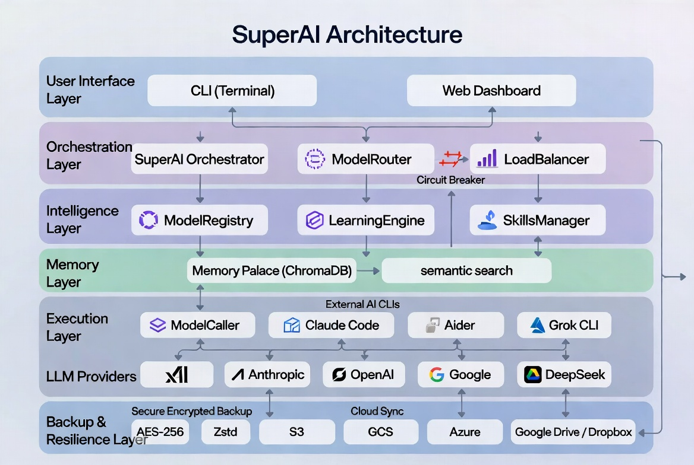

# SuperAI

**SuperAI** — An intelligent, self-improving multi-model AI super app that orchestrates any LLM and AI CLI with smart routing, autonomous learning, encrypted backups, and production-grade resilience.

## ✨ Key Features

See [FEATURES.md](FEATURES.md) for the complete detailed feature list.

**Highlights:**
- Intelligent multi-model routing with multiple strategies + Circuit Breaker
- Self-learning system with automatic skill creation & improvement
- Persistent semantic memory (ChromaDB)
- Dynamic discovery of 20+ AI CLIs and models across 17+ providers
- Fully automated encrypted incremental backups with cloud sync
- Human override always takes priority

## 🏗️ Architecture



> Full architecture details and explanation: [docs/architecture.md](docs/architecture.md)

## 🚀 Installation

```bash
git clone https://github.com/realburhanhusain/superai.git
cd superai

pip install -e .
```

## ▶️ Quick Start

```bash
# First time setup (recommended)
superai init

# List available models
superai list-models

# Set your preferred supervisor model
superai set-supervisor grok-4.5

# Check backup status
superai backup-status
```

## 📦 Core CLI Commands

| Command                        | Description |
|--------------------------------|-------------|
| `superai init`                 | Initialize SuperAI + optional encrypted backup setup |
| `superai discover`             | Discover installed AI CLIs and models |
| `superai list-models [--refresh]` | List all known models (with optional web refresh) |
| `superai set-supervisor <model>` | Set default supervisor model |
| `superai set-strategy <strategy>` | Change load balancing strategy |
| `superai backup-status`        | View backup statistics |
| `superai backup-verify`        | Verify integrity of latest backup |

> See [QUICK_REFERENCE.md](QUICK_REFERENCE.md) for the full command list.

## 🛡️ Backup & Security

SuperAI automatically creates **encrypted and compressed** local backups on clean exit.

- Backups are stored in `./backups/`
- Encryption key is saved in `config/.backup_key` (back this up!)
- Optional cloud sync via `rclone` (supports S3, GCS, Azure, Google Drive, Dropbox, etc.)

## 🧠 Architecture Highlights

- `ModelRegistry` — Curated list of latest + historical models across vendors
- `ModelRouter` + `LoadBalancer` — Intelligent routing with multiple strategies and resilience
- `LearningEngine` — Self-improvement through outcome feedback
- `SecureBackupManager` — Encrypted incremental backups with cloud support

## 📄 License

This project is licensed under the MIT License — see the [LICENSE](LICENSE) file for details.

## 🤝 Contributing

Contributions are welcome! Please read our [Code of Conduct](CODE_OF_CONDUCT.md) before participating.

Feel free to open issues or submit pull requests.

---

**Built with ❤️ using Grok** — July 2026
