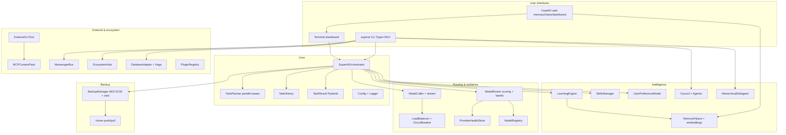

# SuperAI Architecture (as implemented)



## Package layout

```
src/superai/
  cli/main.py, dashboard.py
  web_app.py
  core/
    orchestrator.py, task_planner.py, task_result.py
    model_*.py, load_balancer.py, bandit_router.py
    memory_*.py, embeddings.py, learning_engine.py, skills.py
    backup_manager.py, preferences.py, time_travel.py
    external_cli.py, mcp_context.py, tool_proposals.py
    messengers.py, ecosystem.py, observability.py
    council.py, agentic.py, hierarchy.py
    databao_adapter.py, vega_charts.py, plugin_registry.py
    discovery.py, wings.py, config.py, history.py, errors.py
```

## Runtime data (`~/.superai/`)

| Path | Content |
|------|---------|
| `config.json` | User settings |
| `history/` | Task run JSON |
| `memory/` | Chroma / memory stores |
| `skills/` | Markdown skills + index |
| `backups/` | Encrypted archives |
| `.backup_key` | AES key (protect) |
| `provider_health.json` | Health + quotas |
| `bandit_state.json` | Bandit arms |
| `contexts/` | MCP context packs |
| `plugins/` | Local plugin manifests |
| `charts/` | Generated Vega HTML |
| `feedback.jsonl` | Cross-surface feedback |
| `messenger_log.jsonl` | Messenger bus log |

## Execution path

1. CLI `run` → `SuperAIOrchestrator.run_task`
2. Classify → plan steps (parallel edges allowed)
3. Topological batches: serial or ThreadPool for `can_run_parallel`
4. Per step: router (+bandit) → caller → LB/health
5. Aggregate → history + learn + preferences + bandit reward
6. Optional atexit incremental backup

## References

- Board: `TASKBOARD.md`
- Progress: `docs/PROGRESS.md`
- Plans: `implementation_plan_detailed.md`
