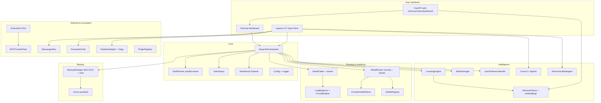

# SuperAI Architecture (as implemented)



## Package layout

```
src/
  cli/                 # directory name (import package: scli)
    main.py            # Typer app — entry: superai = "scli.main:app"
    dashboard.py
    web_app.py
  core/                # import package: core
    orchestrator.py, task_planner.py, task_result.py
    model_*.py, load_balancer.py, bandit_router.py
    memory_*.py, embeddings.py, learning_engine.py, skills.py
    …
```

Imports: `from core.…` and `from scli.…`  
(Note: the CLI package is imported as `scli` because a third-party `cli.py` on some systems shadows the name `cli`.)

## Wave-2 surfaces (2026-07-14)

- Safety: `approval_tui`, `keyring_store`, `workspace`, `compliance`, `secrets`  
- Product: `chat_session`, `tdd_loop`, `diff_edit`, `workspace_index`, `doctor`  
- Interop: `mcp_server`, `langgraph_export`, PWA `/pwa/`, VS Code `extensions/vscode-superai`  
- Memory: FAISS backend (`SUPERAI_MEMORY_BACKEND=faiss`), GDPR forget/TTL, encrypted sync  

## Runtime data (`~/.superai/`)

| Path | Content |
|------|---------|
| `config.json` | User settings |
| `history/` | Task run JSON |
| `memory/` | Memory Palace store (SQLite cosine default file; Postgres+pgvector when DSN set) |
| `skills/` | Markdown skills + index |
| `backups/` | Encrypted archives |
| `.backup_key` | AES key (protect) |
| `provider_health.json` | Health + quotas |
| `bandit_state.json` | Bandit arms |
| `contexts/` | MCP context packs |
| `plugins/` | Local plugin manifests |
| `charts/` | Generated Vega HTML |
| `feedback.jsonl` | Cross-surface feedback |
| `messenger_log.jsonl` | Messenger bus log |

## Execution path

1. CLI `run` → `SuperAIOrchestrator.run_task`
2. Classify → plan steps (parallel edges allowed)
3. Topological batches: serial or ThreadPool for `can_run_parallel`
4. Per step: router (+bandit) → caller → LB/health
5. Aggregate → history + learn + preferences + bandit reward
6. Optional atexit incremental backup

## References

- Board: `TASKBOARD.md`
- Progress: `docs/PROGRESS.md`
- Plans: `implementation_plan_detailed.md`
