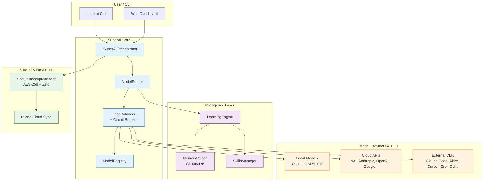

# SuperAI Architecture

```mermaid
flowchart TB
    subgraph User["User / CLI"]
        CLI[superai CLI]
        Web[Web Dashboard]
    end

    subgraph Core["SuperAI Core"]
        Orchestrator[SuperAIOrchestrator]
        Router[ModelRouter]
        LoadBalancer[LoadBalancer<br/>+ Circuit Breaker]
        Registry[ModelRegistry]
    end

    subgraph Intelligence["Intelligence Layer"]
        Learning[LearningEngine]
        Memory[MemoryPalace<br/>ChromaDB]
        Skills[SkillsManager]
    end

    subgraph Backup["Backup & Resilience"]
        SecureBackup[SecureBackupManager<br/>AES-256 + Zstd]
        Rclone[rclone Cloud Sync]
    end

    subgraph Providers["Model Providers & CLIs"]
        direction LR
        Local[Local Models<br/>Ollama, LM Studio]
        Cloud[Cloud APIs<br/>xAI, Anthropic, OpenAI, Google...]
        External[External CLIs<br/>Claude Code, Aider, Cursor, Grok CLI...]
    end

    CLI --> Orchestrator
    Web --> Orchestrator

    Orchestrator --> Router
    Router --> LoadBalancer
    LoadBalancer --> Registry

    Router --> Learning
    Learning --> Memory
    Learning --> Skills

    Orchestrator --> SecureBackup
    SecureBackup --> Rclone

    LoadBalancer --> Local
    LoadBalancer --> Cloud
    LoadBalancer --> External

    classDef core fill:#e3f2fd,stroke:#1976d2
    classDef intel fill:#f3e5f5,stroke:#7b1fa2
    classDef backup fill:#e8f5e9,stroke:#388e3c
    classDef provider fill:#fff3e0,stroke:#f57c00

    class Orchestrator,Router,LoadBalancer,Registry core
    class Learning,Memory,Skills intel
    class SecureBackup,Rclone backup
    class Local,Cloud,External provider
```