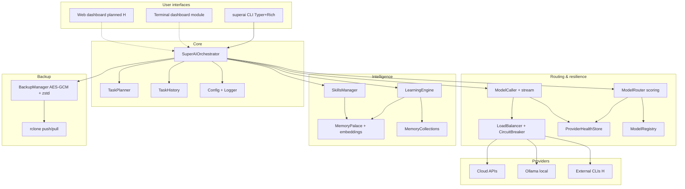

# SuperAI Architecture (as implemented)



## Package layout

```
src/superai/
  cli/main.py           # Typer commands
  cli/dashboard.py      # Terminal dashboard (Rich)
  core/
    orchestrator.py
    task_planner.py
    config.py, logger.py, history.py, errors.py
    model_registry.py, model_router.py, model_caller.py
    load_balancer.py, provider_health.py, provider_smoke.py
    model_refresh.py, routing_stats.py
    memory_palace.py, embeddings.py, memory_collections.py
    learning_engine.py, skills.py
    backup_manager.py
    external_cli.py     # External CLI delegation (H)
    tool_proposals.py   # Tool proposal / approval (H)
    wings.py            # Memory wings & rooms (I)
    discovery.py        # First-run / CLI discovery (I)
```

## Runtime data (`~/.superai/`)

| Path | Content |
|------|---------|
| `config.json` | User settings |
| `history/` | Task run JSON |
| `memory/` | Chroma / memory stores |
| `skills/` | Markdown skills + index |
| `backups/` | Encrypted archives |
| `.backup_key` | AES key (protect) |
| `provider_health.json` | Health + quotas |

## Execution path (happy path)

1. CLI `run` → `SuperAIOrchestrator.run_task`
2. Classify task → plan steps → inject skills + past learnings
3. Per step: `ModelRouter.select_model` → `ModelCaller.call` (LB + health)
4. Aggregate result → history + `learn_from_task` → optional skill auto-create
5. On process exit (if enabled): quiet incremental backup

## References

- Plans: `implementation_plan_detailed.md`, `implementation_plan_v2.md`
- Board: `TASKBOARD.md`
